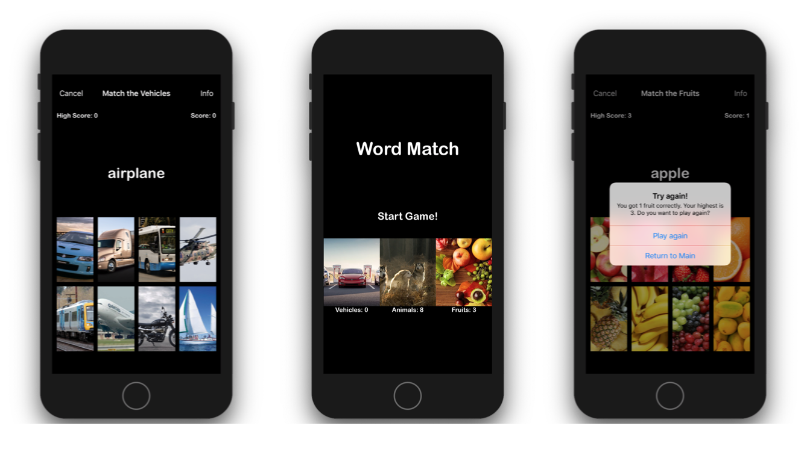

# WordMatching

Word Matching app is a simple game for young children to help them associate words with images. 

### Description

The objective of the game is for the children to match the correct image with the word displayed.

Children can choose from 3 different sets of images. The order when words appear are shuffled. 
Current score is increment on each correct guess. A high score is recorded for each set.

### Screenshots

### License

WordMatching is available under the MIT License. See the [LICENSE](https://github.com/arvnq/WordMatching/blob/master/LICENSE) file for more info.
